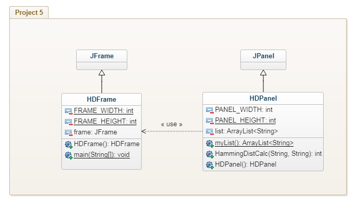

# Project-5
## UML Diagram

## Problems Faced and How I Solved Them
* The first huge problem I came across was how to set up the Layout of the window. In order to fix this, I created a diagram of grids to hold the components I need. I split up the main panel into two parts: the required part and the creative part. I added the components required to one panel and I added the creative part to another panel and then added those panels to the main panel.
* The next problem I came across was how was I going to read the file and where was I going to store it. For this, I created private ArrayList of strings to hold the station ID's from the file. I think created a Method that when called upon would return an ArrayList of strings that is obtained by reading the file and adding the string to the list.
* After that I added a method from Project 1 which calculated the Hamming Distance of 2 strings.
* The required panel tooks some time to figure out how to set up the GridLayout to output a desired look, but through a bunch of minor changes to sizes and placement I was able to created a disired window. 
* Many of the actionListeners i added took some time to write out but once I got a feel for how to write them, I was flying through the last few of them.
* For my creative panel, I really sat down and thought about how I could possibly display the data. I first thought a bar graph would be a good edition to this little application, but I couldn't think of way to use what I knew to create one. So instead, I thought it would be nice to know how many station ID's have the same letter in those specified positions. So I created a little widget that has a button and just outputs the letters of the station selected and the number of stations that share the same letter in that position.
